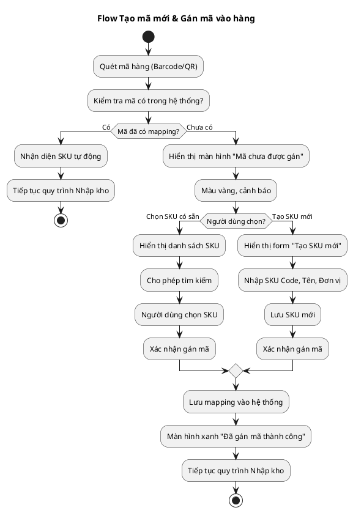
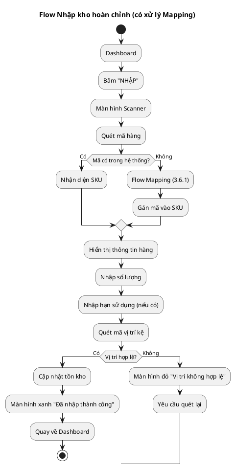

# LEAN WMS - BLUEPRINT FOR DESIGNER
## Hướng dẫn thiết kế giao diện & Trải nghiệm người dùng

**Mục tiêu:** Định nghĩa cách người dùng tương tác với app - Tốc độ quét và Phản hồi tức thì.

---

## 1. UX WIREFRAME & PRINCIPLES (Giao diện & Trải nghiệm)

### 1.1. Màn hình chính (The Dashboard)

- **Layout:** Chỉ có 3 nút khổng lồ (tối thiểu 120x120px): **NHẬP** - **XUẤT** - **KIỂM KHO**
- **Thông số hiển thị ngay trang đầu:**
  - Số đơn hàng cần xử lý (Badge đỏ nếu > 0)
  - Số lượng hàng sắp hết (Cảnh báo vàng)
  - Tên công nhân đang đăng nhập
- **Nguyên tắc:** Không có menu phức tạp, không có sub-menu. Mỗi màn hình chỉ có 1 mục đích.

### 1.2. Màn hình Quét (The Scanner)

- **Chiếm toàn bộ khung hình** (Full-screen camera view)
- **Tích hợp đèn Flash** (Toggle button góc trên bên phải)
- **Thanh trượt Zoom** (Slider bên trái màn hình)
- **Overlay hướng dẫn:** "Đưa mã vào khung hình"
- **Auto-focus:** Tự động lấy nét khi phát hiện mã QR/Barcode
- **Continuous Scan Mode:** Camera luôn bật, không cần bấm nút chụp

### 1.3. Màn hình Phản hồi (Feedback Loop)

#### Thành công:
- Hiện dấu tích xanh (✓) toàn màn hình
- Rung nhẹ (Haptic feedback 100ms)
- Âm thanh "Ting" (Tần số cao, ngắn 200ms)
- Màn hình chuyển màu xanh lá (#00FF00) trong 500ms

#### Thất bại:
- Hiện dấu X đỏ (✗) toàn màn hình
- Rung mạnh (Haptic feedback 500ms)
- Âm thanh "Buzz" (Tần số thấp, dài 800ms)
- Màn hình chuyển màu đỏ (#FF0000) trong 1000ms
- Hiển thị lý do lỗi: "Sai hàng", "Hết hạn", "Sai vị trí"

### 1.4. Nguyên tắc Poka-Yoke (Chống sai lỗi)

- **Không cho phép bấm "Xác nhận" nếu:**
  - Chưa quét đủ số lượng theo đơn hàng
  - Quét sai vị trí kệ (nếu có yêu cầu vị trí cụ thể)
  - Quét hàng không nằm trong danh sách đơn hàng
- **Validation real-time:** Kiểm tra ngay khi quét, không đợi đến bước cuối
- **Lock screen:** Không cho phép thao tác khác khi đang trong quy trình quan trọng

### 1.5. Nguyên tắc "Mắt và Ngón tay cái" (Eye & Thumb Rule)

- **Vùng thao tác (Bottom 1/3 màn hình):**
  - Tất cả nút quan trọng (SCAN, CONFIRM, CANCEL) nằm ở đây
  - Kích thước tối thiểu: 60x60px
  - Khoảng cách giữa các nút: 20px

- **Vùng hiển thị (Top 1/3 màn hình):**
  - Tên hàng (Font size 24px, Bold)
  - Số lượng (Font size 32px, Bold)
  - Vị trí kệ (Font size 18px)

- **Tương phản cao:**
  - Chế độ sáng: Chữ đen (#000000) trên nền trắng (#FFFFFF)
  - Chế độ tối: Chữ trắng (#FFFFFF) trên nền đen (#000000)
  - Không dùng màu pastel, xám nhạt

### 1.6. Flow "Dẫn đường" (Guided Workflow)

- **Tuyệt đối không để công nhân tự hỏi "Giờ làm gì tiếp?"**
- **Mỗi màn hình chỉ hiển thị 1 task cụ thể:**
  - "Đơn hàng #123 cần nhặt. Bấm để bắt đầu"
  - "Đến kệ A1, ô số 3"
  - "Quét sản phẩm X"
  - "Đã lấy 5/10. Tiếp tục..."
  - "Hoàn thành! ✓"
- **Nút "Tiếp theo"** luôn hiển thị rõ ràng, không ẩn trong menu

### 1.7. Chế độ rảnh tay (Hands-free Mode)

- **Thiết kế tương thích với:**
  - Armband (Gắn lên cánh tay)
  - Chest mount (Treo trước ngực)
  - Holster (Đeo bên hông)
- **Continuous Scan:** Camera luôn bật, tự động quét khi phát hiện mã
- **Voice feedback:** Có thể bật/tắt âm thanh phản hồi

---

## 2. DESIGN SPECIFICATIONS (Thông số kỹ thuật thiết kế)

### 2.1. Màu sắc (Color Palette)

#### Màu chính:

- **Success Green:** `#00FF00` (Màn hình thành công)
- **Error Red:** `#FF0000` (Màn hình lỗi)
- **Warning Yellow:** `#FFA500` (Cảnh báo)
- **Background Light:** `#FFFFFF` (Nền sáng)
- **Background Dark:** `#000000` (Nền tối)
- **Text Light:** `#FFFFFF` (Chữ trên nền tối)
- **Text Dark:** `#000000` (Chữ trên nền sáng)

#### Nguyên tắc:

- Tương phản tối thiểu 4.5:1 (WCAG AA)
- Không dùng màu pastel, xám nhạt
- Màu sắc phải rõ ràng ngay cả trong điều kiện ánh sáng yếu

### 2.2. Typography (Chữ viết)

#### Font sizes:

- **Heading 1:** 32px (Bold) - Số lượng
- **Heading 2:** 24px (Bold) - Tên hàng
- **Body:** 18px (Regular) - Vị trí kệ
- **Caption:** 14px (Regular) - Hướng dẫn

#### Nguyên tắc:

- Font sans-serif (dễ đọc trên màn hình nhỏ)
- Line height: 1.5x font size
- Letter spacing: 0.5px cho chữ lớn

### 2.3. Spacing (Khoảng cách)

- **Padding nút:** 16px
- **Margin giữa các nút:** 20px
- **Padding màn hình:** 16px
- **Khoảng cách giữa các element:** 12px

### 2.4. Iconography (Biểu tượng)

- **Kích thước icon:** Tối thiểu 24x24px
- **Stroke width:** 2px
- **Style:** Outline (không fill)
- **Màu:** Theo màu chữ của context

### 2.5. Animation (Hiệu ứng)

#### Thời lượng:

- **Phản hồi quét:** 500ms (thành công), 1000ms (lỗi)
- **Transition màn hình:** 300ms
- **Haptic feedback:** 100ms (thành công), 500ms (lỗi)

#### Nguyên tắc:

- Easing: `ease-out` cho transitions
- Không dùng animation phức tạp (ảnh hưởng performance)
- Animation phải có mục đích rõ ràng

---

## 3. USER FLOWS (Luồng người dùng)

### 3.1. Flow Nhập kho (Inbound Flow)

```
Màn hình Dashboard
    ↓
Bấm "NHẬP"
    ↓
Màn hình Scanner
    ↓
Quét mã hàng
    ↓
[Thành công] → Màn hình xanh → Hiển thị thông tin hàng
    ↓
Nhập số lượng, hạn sử dụng
    ↓
Quét mã vị trí kệ
    ↓
[Thành công] → Màn hình xanh → "Đã nhập thành công"
    ↓
Quay về Dashboard
```

### 3.2. Flow Xuất kho (Outbound Flow)

```
Màn hình Dashboard
    ↓
Bấm "XUẤT"
    ↓
Hiển thị danh sách đơn hàng
    ↓
Chọn đơn hàng
    ↓
Màn hình hướng dẫn: "Đến kệ A1, ô số 3"
    ↓
Bấm "Bắt đầu"
    ↓
Màn hình Scanner
    ↓
Quét mã vị trí → [Kiểm tra đúng vị trí]
    ↓
Quét mã hàng → [Kiểm tra đúng hàng, đủ số lượng]
    ↓
[Thành công] → Màn hình xanh → "Đã lấy 5/10"
    ↓
Tiếp tục hoặc Hoàn thành
```

### 3.3. Flow Kiểm kê (Counting Flow)

```
Màn hình Dashboard
    ↓
Bấm "KIỂM KHO"
    ↓
Chọn khu vực kiểm kê
    ↓
Màn hình Scanner
    ↓
Quét mã vị trí Bin
    ↓
Quét/Đếm hàng trong Bin
    ↓
Nhập số lượng đếm được
    ↓
[So sánh với sổ sách]
    ↓
Hiển thị kết quả: "Khớp" hoặc "Lệch X cái"
    ↓
Tiếp tục hoặc Hoàn thành
```

### 3.4. Flow Tạo mã mới & Gán mã vào hàng (Mapping Flow)

**Mục đích:** Khi quét hàng lạ (chưa có trong hệ thống), cần tạo mapping giữa mã vạch và SKU.

```
Màn hình Dashboard
    ↓
Bấm "NHẬP"
    ↓
Màn hình Scanner
    ↓
Quét mã hàng (Barcode/QR)
    ↓
[Hệ thống kiểm tra]
    ↓
[Mã chưa có trong hệ thống] → Màn hình vàng (Cảnh báo)
    ↓
Hiển thị: "Mã này chưa được gán. Bạn muốn gán vào SKU nào?"
    ↓
[2 lựa chọn]
    ├─ "Chọn SKU có sẵn" → Danh sách SKU → Chọn SKU
    └─ "Tạo SKU mới" → Form nhập thông tin SKU
    ↓
Xác nhận gán mã
    ↓
[Thành công] → Màn hình xanh → "Đã gán mã thành công"
    ↓
Tiếp tục quy trình Nhập kho (nhập số lượng, vị trí...)
```

**Chi tiết màn hình:**

#### Màn hình "Mã chưa được gán"
- **Màu nền:** Vàng (#FFA500) - Cảnh báo
- **Icon:** Dấu chấm hỏi (?) lớn ở giữa
- **Thông tin hiển thị:**
  - Mã vạch vừa quét: `8934567890123` (Font size 20px, Bold)
  - Thông báo: "Mã này chưa được gán vào sản phẩm nào"
- **2 nút lớn (Bottom 1/3 màn hình):**
  - "Chọn SKU có sẵn" (Màu xanh dương)
  - "Tạo SKU mới" (Màu xanh lá)
- **Nút "Hủy"** (Màu đỏ, góc trên bên trái)

#### Màn hình "Chọn SKU có sẵn"
- **Layout:** Danh sách scrollable
- **Mỗi item hiển thị:**
  - SKU Code: `SKU_AO_THUN` (Font size 18px, Bold)
  - Tên sản phẩm: "Áo thun cổ tròn" (Font size 16px)
  - Đơn vị: "Cái" (Font size 14px, màu xám)
- **Thanh tìm kiếm** ở đầu danh sách (có thể tìm theo SKU Code hoặc tên)
- **Nút "Xác nhận"** ở cuối danh sách (chỉ enable khi đã chọn SKU)

#### Màn hình "Tạo SKU mới"
- **Form nhập:**
  - SKU Code: (Text input, bắt buộc, format: `SKU_XXX`)
  - Tên sản phẩm: (Text input, bắt buộc)
  - Đơn vị tính: (Dropdown: Cái, Kg, Thùng, Bao...)
  - Giá nhập: (Number input, tùy chọn)
  - Giá xuất: (Number input, tùy chọn)
- **Nút "Lưu"** (Bottom, màu xanh lá)
- **Nút "Hủy"** (Góc trên bên trái)

#### Màn hình "Xác nhận gán mã"
- **Hiển thị thông tin:**
  - Mã vạch: `8934567890123`
  - Được gán vào: `SKU_AO_THUN - Áo thun cổ tròn`
  - Nguồn mã: `VENDOR_A` (Dropdown: INTERNAL, VENDOR_A, VENDOR_B, CUSTOM)
- **Nút "Xác nhận"** (Màu xanh lá, lớn)
- **Nút "Sửa lại"** (Màu xám, nhỏ)

**Lưu ý:**
- Mapping chỉ tạo 1 lần, dùng mãi (trừ khi bị vô hiệu hóa)
- Sau khi gán mã thành công, quy trình Nhập kho tiếp tục bình thường
- Nếu quét lại mã đã được gán → Tự động nhận diện SKU, không hiện màn hình gán mã

### 3.5. Flow Inbound với Mapping (Nhập kho hàng lạ)

```
Màn hình Dashboard
    ↓
Bấm "NHẬP"
    ↓
Màn hình Scanner
    ↓
Quét mã hàng
    ↓
[Kiểm tra mapping]
    ├─ [Đã có mapping] → Nhận diện SKU → Tiếp tục nhập số lượng
    └─ [Chưa có mapping] → Flow Mapping (3.4)
                            ↓
                        [Sau khi gán mã]
                            ↓
                        Tiếp tục nhập số lượng
    ↓
Nhập số lượng, hạn sử dụng
    ↓
Quét mã vị trí kệ
    ↓
[Thành công] → Màn hình xanh → "Đã nhập thành công"
    ↓
Quay về Dashboard
```

---

## 3.6. PlantUML Diagrams (Sơ đồ luồng)

### 3.6.1. Flow Tạo mã mới & Gán mã vào hàng (Mapping Flow)



### 3.6.2. Flow Quản lý Dashboard (Phase 2 - Tương lai)

**Lưu ý:** Tính năng này thuộc Phase 2, chưa triển khai trong MVP.

```plantuml
@startuml Management Dashboard Flow
title Flow Quản lý Dashboard (Phase 2)

start
:Đăng nhập với quyền Manager;
:Dashboard Quản lý;

if (Chức năng?) then (Quản lý Sản phẩm)
  :Xem danh sách SKU;
  if (Thao tác?) then (Tạo mới)
    :Form tạo SKU mới;
    :Nhập thông tin SKU;
    :Lưu SKU;
  else (Sửa)
    :Chọn SKU cần sửa;
    :Form chỉnh sửa;
    :Lưu thay đổi;
  else (Xóa)
    :Xác nhận xóa SKU;
    :Xóa SKU (soft delete);
  else (Xem chi tiết)
    :Hiển thị thông tin SKU;
    :Xem lịch sử mapping;
    :Xem tồn kho theo vị trí;
  endif
  
else (Quản lý Tồn kho)
  :Xem tổng quan tồn kho;
  :Lọc theo SKU/Vị trí;
  :Xem chi tiết từng vị trí;
  :Điều chỉnh số lượng (Adjust);
  
else (Quản lý Đơn hàng)
  :Xem danh sách đơn hàng;
  :Tạo đơn hàng mới;
  :Theo dõi tiến độ;
  :Duyệt đơn hàng;
  
else (Báo cáo)
  :Xem báo cáo tồn kho;
  :Xem báo cáo xuất nhập;
  :Xem báo cáo lỗi;
  :Export Excel/PDF;
endif

stop

@enduml
```

### 3.6.3. Flow Nhập kho hoàn chỉnh (Inbound với Mapping)



---

## 4. ERROR STATES (Trạng thái lỗi)

### 4.1. Camera Permission Denied

**Màn hình hiển thị:**
- Icon camera bị gạch chéo (màu đỏ)
- Tiêu đề: "Cần quyền Camera"
- Mô tả: "Để quét mã, vui lòng cấp quyền Camera cho app"
- Nút: "Mở Settings" (Deep link vào Settings)
- Nút: "Hủy" (Quay về Dashboard)

### 4.2. Mã không hợp lệ

**Màn hình hiển thị:**
- Dấu X đỏ toàn màn hình
- Rung mạnh (500ms)
- Âm thanh "Buzz"
- Thông báo: "Mã không hợp lệ. Vui lòng quét lại"
- Tự động quay về Scanner sau 2 giây

### 4.3. Sai hàng/Sai vị trí

**Màn hình hiển thị:**
- Dấu X đỏ toàn màn hình
- Rung mạnh (500ms)
- Âm thanh "Buzz"
- Thông báo cụ thể:
  - "Sai hàng. Đơn hàng yêu cầu: [Tên hàng]"
  - "Sai vị trí. Yêu cầu đến: [Vị trí]"
- Nút: "Quét lại"

### 4.4. Offline Mode

**Badge hiển thị:**
- Góc trên bên phải màn hình
- Màu vàng (#FFA500)
- Text: "Đang offline"
- Icon: Wifi bị gạch chéo

**Khi có mạng lại:**
- Badge chuyển xanh: "Đang đồng bộ..."
- Sau khi sync xong: Badge biến mất

---

## 5. ACCESSIBILITY (Khả năng tiếp cận)

### 5.1. Screen Reader Support

- Tất cả nút phải có `accessibilityLabel`
- Thông báo quan trọng phải được đọc tự động
- Mô tả rõ ràng cho các trạng thái (thành công/lỗi)

### 5.2. High Contrast Mode

- Hỗ trợ chế độ tương phản cao
- Tự động điều chỉnh màu sắc khi bật High Contrast

### 5.3. Font Scaling

- Hỗ trợ font scaling của hệ thống
- Tối thiểu: 14px (không nhỏ hơn)
- Tối đa: 32px (không lớn hơn)

### 5.4. Touch Targets

- Kích thước tối thiểu: 44x44px (iOS), 48x48px (Android)
- Khoảng cách giữa các nút: Tối thiểu 8px

---

## 6. PROTOTYPING GUIDELINES (Hướng dẫn tạo prototype)

### 6.1. Tools khuyến nghị

- **Figma:** Cho UI design và prototyping
- React + TailwindCSS + Vite + TypeScript: screen mẫu cho các màn hình

### 6.2. Prototype Requirements

- **Fidelity:** High-fidelity (giống app thật)
- **Interactivity:** Tất cả nút phải clickable
- **Animation:** Mô phỏng đúng thời lượng và easing
- **Feedback:** Mô phỏng haptic feedback và âm thanh

### 6.3. Testing Scenarios

- Test trên thiết bị thật (không chỉ desktop)
- Test trong điều kiện ánh sáng yếu
- Test với ngón tay cái (one-handed use)
- Test với người dùng thật (công nhân kho)

---

## 7. PHASE 2 FEATURES (Tính năng tương lai)

**Lưu ý:** Các tính năng dưới đây thuộc Phase 2, chưa triển khai trong MVP Phase 1.

### 7.1. Dashboard Quản lý (Management Dashboard)

**Mục đích:** Dành cho Chủ xưởng/Quản lý để quản lý kho hàng, không phải công nhân.

**Tính năng dự kiến:**
- **Quản lý Sản phẩm (SKU):**
  - CRUD SKU (Tạo, Sửa, Xóa, Xem)
  - Quản lý mapping mã vạch
  - Xem lịch sử thay đổi
- **Quản lý Tồn kho:**
  - Xem tổng quan tồn kho theo SKU
  - Xem tồn kho theo vị trí
  - Điều chỉnh số lượng (Adjust)
  - Cảnh báo hàng sắp hết
- **Quản lý Đơn hàng:**
  - Tạo đơn hàng xuất/nhập
  - Theo dõi tiến độ đơn hàng
  - Duyệt đơn hàng quan trọng
- **Báo cáo:**
  - Báo cáo tồn kho
  - Báo cáo xuất nhập
  - Báo cáo lỗi/điều chỉnh
  - Export Excel/PDF

**Thiết kế:**
- Layout desktop-first (không phải mobile-first)
- Sử dụng bảng dữ liệu (Data tables)
- Filters và Search nâng cao
- Charts và Visualizations

**Lưu ý:** Phase 1 chỉ tập trung vào app cho công nhân (mobile). Dashboard quản lý sẽ được phát triển sau khi MVP hoàn thành.

---

## LƯU Ý QUAN TRỌNG CHO DESIGNER

✅ **NÊN tập trung vào:**
- Tốc độ nhận diện và phản hồi
- Tính rõ ràng của thông tin
- Trải nghiệm rảnh tay (hands-free)
- Phản hồi tức thì (immediate feedback)
- Flow Mapping (tạo mã và gán mã) - **MỚI THÊM**

❌ **KHÔNG NÊN:**
- Thiết kế quá phức tạp
- Dùng quá nhiều màu sắc
- Ẩn thông tin quan trọng trong menu
- Bỏ qua edge cases (lỗi, offline, etc.)
- Thiết kế Dashboard quản lý trong Phase 1 (để dành Phase 2)

