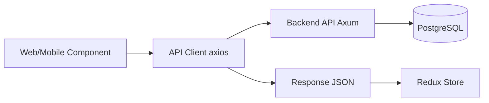
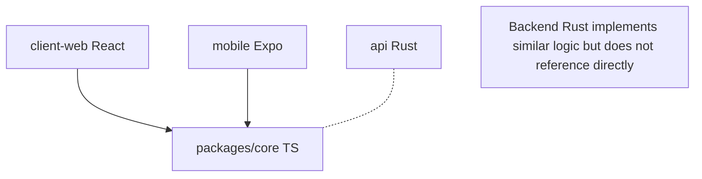
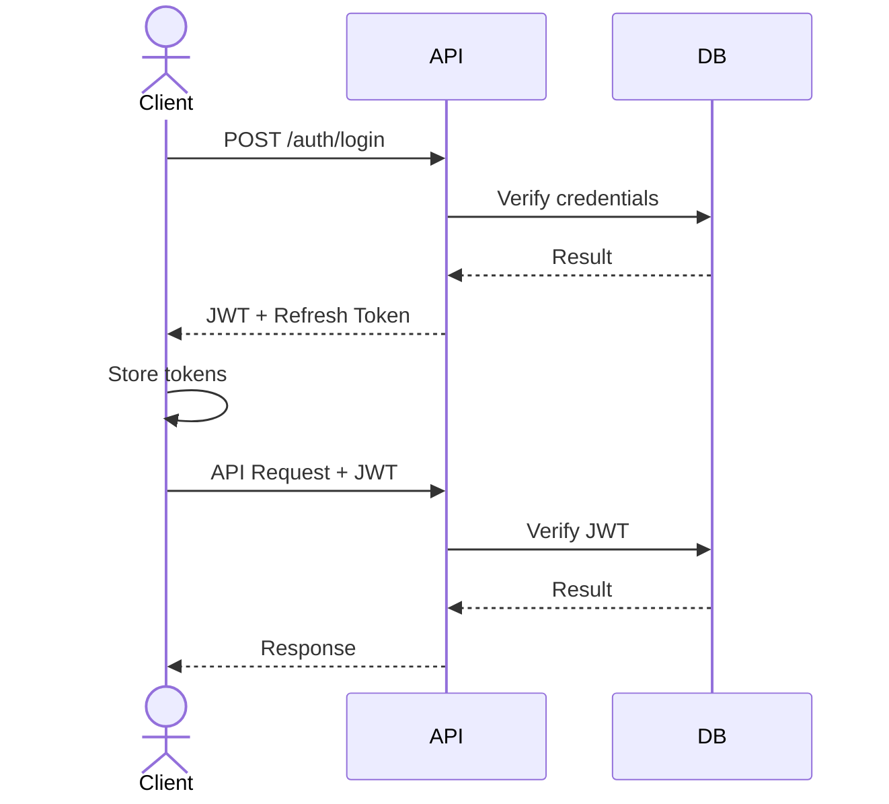
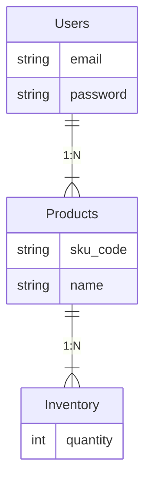
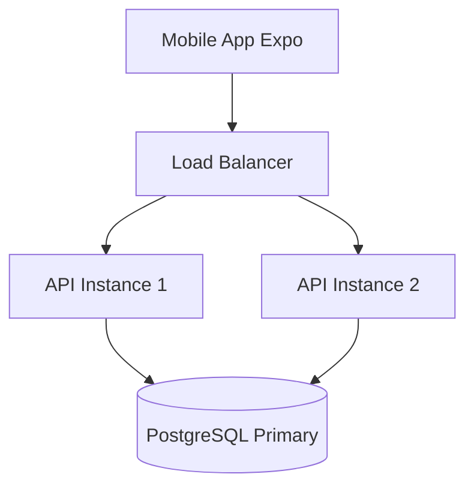

# ARCHITECTURE - Kiến trúc Hệ thống Lean WMS

**Mục tiêu:** Giải thích cấu trúc Monorepo, kiến trúc tổng thể, và cách các thành phần (components) tương tác với nhau.

---

## 📐 Tổng quan Kiến trúc Hệ thống

```mermaid
graph TD
    subgraph Monorepo [LEAN WMS MONOREPO]
        client[client-web\n(React)]
        mobile[mobile\n(Expo)]
        api[api\n(Rust)]
        subgraph Core [packages/core]
            ts[TypeScript]
            fefo[FEFO/FIFO]
            val[Validation]
            types[Types]
        end
    end
    client --> Core
    mobile --> Core
    api -.-> Core
```

---

## 🏗️ Cấu trúc Monorepo

### Tại sao Monorepo?

**Ưu điểm:**

1. ✅ **Chia sẻ Code (Shared Code):** `packages/core` được dùng chung bởi web và mobile
2. ✅ **An toàn kiểu (Type Safety):** Có thể chia sẻ types giữa frontend và backend (qua rspc/OpenAPI)
3. ✅ **Thay đổi nguyên tử (Atomic Changes):** Sửa API + frontend trong cùng 1 PR
4. ✅ **Nguồn sự thật duy nhất (Single Source of Truth):** Một repo, một version, dễ đồng bộ
5. ✅ **CI/CD thống nhất:** Test toàn bộ cùng lúc

**Nhược điểm:**

1. ⚠️ **Onboarding:** Dev mới cần hiểu nhiều công nghệ (Rust, TypeScript, React)
2. ⚠️ **Thời gian Build:** Có thể chậm hơn nếu không dùng caching (Turbo giải quyết vấn đề này)

**Kết luận:** Với dự án có chia sẻ logic và cần thay đổi đồng bộ, Monorepo là lựa chọn hợp lý.

### Cấu trúc thư mục

```folder-tree
lean-wms/
├── apps/
│   ├── api/                    # Backend Rust
│   │   ├── src/
│   │   │   ├── api/           # Các routes API (REST endpoints)
│   │   │   ├── services/      # Logic nghiệp vụ (Business logic)
│   │   │   ├── database/      # Các models cơ sở dữ liệu (SeaORM)
│   │   │   └── main.rs        # Điểm khởi chạy (Entry point)
│   │   └── Cargo.toml
│   │
│   ├── client-web/            # Frontend Web + Desktop
│   │   ├── src/
│   │   │   ├── components/    # Các components React
│   │   │   ├── screens/       # Các trang (Page components)
│   │   │   ├── store/         # Redux slices
│   │   │   ├── services/      # API client
│   │   │   └── App.tsx        # Điểm khởi chạy
│   │   └── package.json
│   │
│   └── mobile/                # Mobile App (Expo)
│       ├── src/
│       │   ├── screens/       # Các màn hình (Screen components)
│       │   ├── store/         # Redux slices
│       │   ├── services/      # API client
│       │   └── App.tsx        # Điểm khởi chạy
│       └── package.json
│
├── packages/
│   └── core/                  # Logic TypeScript dùng chung
│       ├── src/
│       │   ├── inventory/     # Thuật toán FEFO/FIFO
│       │   ├── validation/    # Các quy tắc kiểm tra (Validation rules)
│       │   ├── types/         # Các kiểu dữ liệu dùng chung (Shared types)
│       │   └── index.ts       # Public API
│       └── package.json
│
├── doc/                       # Tài liệu (Documentation)
├── package.json               # Cấu hình workspace gốc (pnpm)
├── pnpm-workspace.yaml        # Định nghĩa pnpm workspace
├── turbo.json                 # Cấu hình pipeline build Turbo
└── Cargo.toml                 # Cấu hình workspace Rust
```

---

## 🔄 Luồng dữ liệu (Data Flow)

### 1. Luồng Frontend → Backend



### 2. Luồng Logic dùng chung



**Lưu ý:** Backend Rust không dùng `packages/core` trực tiếp vì khác ngôn ngữ. Thay vào đó:

- Backend cài đặt logic tương tự trong Rust
- Có thể chia sẻ types qua OpenAPI schema hoặc rspc code generation

---

## 🧩 Chi tiết các thành phần (Component Details)

### 1. `apps/api` - Backend Rust

**Tech Stack:**

- **Framework:** Axum (async web framework)
- **Protocol:** REST + RSPC (Type-safe procedures)
- **ORM:** SeaORM
- **Database:** PostgreSQL
- **Auth:** JWT với refresh token

**Trách nhiệm:**

- Các điểm cuối RESTful API
- RSPC Procedures cho Frontend
- Kiểm tra logic nghiệp vụ (Business logic validation)
- Các thao tác cơ sở dữ liệu
- Xác thực & Phân quyền (Authentication & Authorization)
- WebSocket sync (tương lai)

### 2. `apps/client-web` - Frontend Web

**Tech Stack:**

- **Framework:** React 19 + TypeScript
- **Build Tool:** Vite
- **State:** Redux Toolkit
- **Routing:** TanStack Router
- **Styling:** Tailwind CSS
- **Desktop:** Tauri (Sẵn sàng cho desktop - Phase 2)

**Trách nhiệm:**

- Giao diện Web cho quản lý
- Ứng dụng Desktop (Tauri wrapper)
- Quản lý trạng thái (State management)
- Giao tiếp API

### 3. `apps/mobile` - Mobile App

**Tech Stack:**

- **Framework:** Expo (React Native)
- **Language:** TypeScript
- **State:** Redux Toolkit
- **Navigation:** React Navigation
- **Camera:** react-native-vision-camera

**Trách nhiệm:**

- Giao diện Mobile cho công nhân
- Quét mã vạch (Barcode scanning)
- Hoạt động ưu tiên offline (Offline-first operations)
- Đồng bộ với backend

### 4. `packages/core` - Logic dùng chung

**Tech Stack:**

- **Language:** TypeScript
- **Validation:** Zod
- **Style:** Functional Programming

**Trách nhiệm:**

- Logic nghiệp vụ (FEFO/FIFO)
- Các quy tắc kiểm tra (Validation rules)
- Các kiểu dữ liệu dùng chung (Shared types)
- Các hàm tiện ích (Utility functions)

**Ví dụ sử dụng:**

```typescript
// Trong client-web hoặc mobile
import { calculateFEFO, validateLocation } from '@lean-wms/core';

const items = calculateFEFO(inventoryItems);
const isValid = validateLocation(locationCode);
```

---

## 🔧 Công cụ Build & Development

### Turbo (Hệ thống Build)

(Xem `turbo.json`)

- ✅ Thực thi song song (Parallel execution)
- ✅ Caching thông minh (Smart caching)
- ✅ Biểu đồ phụ thuộc (Dependency graph)

### pnpm Workspace

(Xem `pnpm-workspace.yaml`)

- ✅ Hoisting
- ✅ Giao thức Workspace
- ✅ Cài đặt nhanh hơn

### Cargo Workspace

(Xem `Cargo.toml`)

- ✅ Quản lý các thư viện Rust (Rust crates)

---

## 🔐 Luồng xác thực (Authentication Flow)



---

## 📊 Sơ đồ Database (Mức cao)



**Chi tiết:** Xem [ADR 0002: Backend Architecture Blueprint](./adr/0002-backend-architecture-blueprint.md)

---

## 🚀 Kiến trúc Triển khai (Tương lai)



---

## 📚 Tài liệu liên quan

- **Onboarding:** [`../guides/CONTRIBUTING.md`](../guides/CONTRIBUTING.md)
- **Backend Architecture (ADR 0002):** [`./adr/0002-backend-architecture-blueprint.md`](./adr/0002-backend-architecture-blueprint.md)
- **Frontend Architecture (ADR 0003):** [`./adr/0003-frontend-architecture-blueprint.md`](./adr/0003-frontend-architecture-blueprint.md)
- **Triển khai:** [`../guides/DEVOPS_GUIDE.md`](../guides/DEVOPS_GUIDE.md)
- **Archive (Historical Docs):** [`../archive/`](../archive/)

---

**Cập nhật lần cuối:** 15-01-2026
