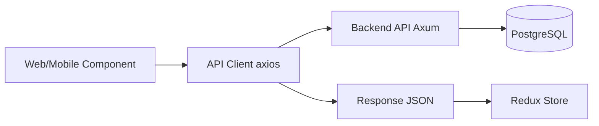
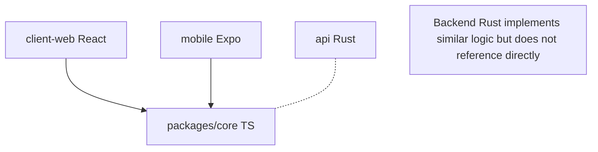
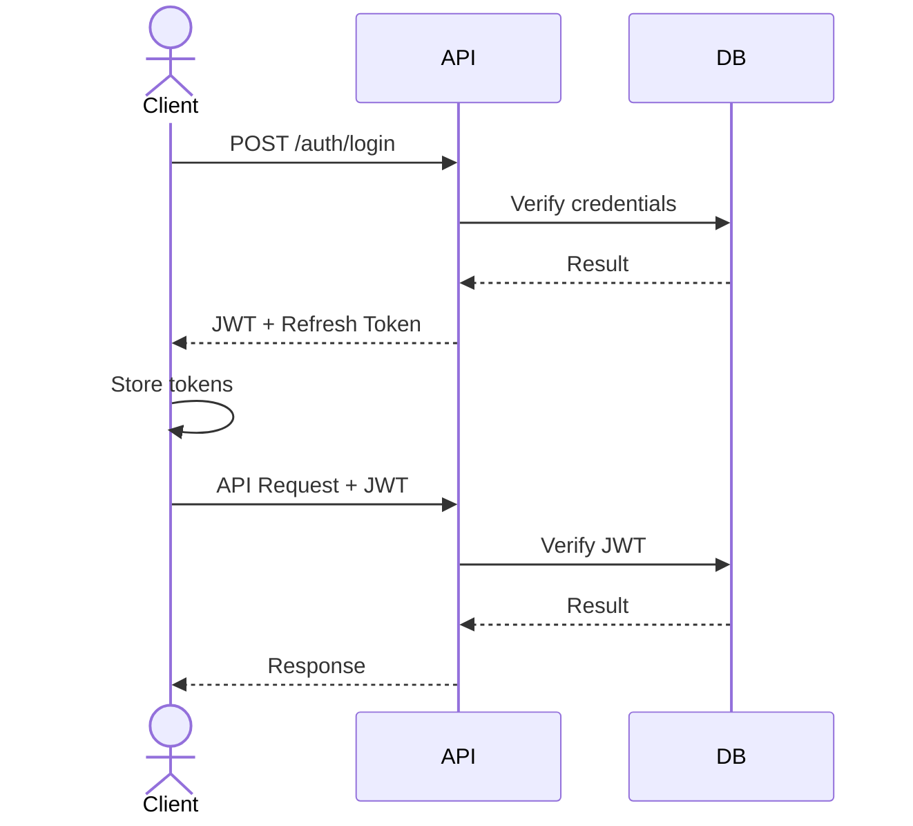
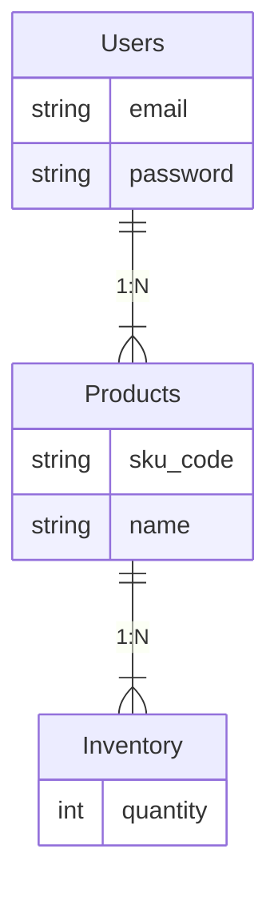
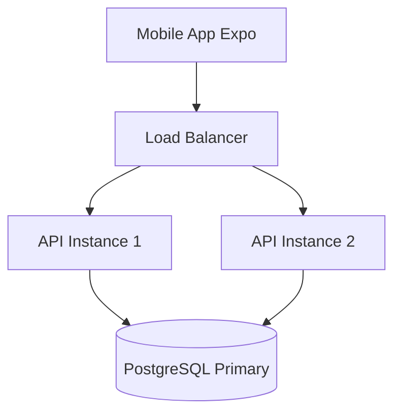

# ARCHITECTURE - Hệ thống Lean WMS

**Mục tiêu:** Giải thích cấu trúc Monorepo, kiến trúc tổng thể, và cách các components tương tác với nhau.

---

## 📐 System Architecture Overview

```mermaid
graph TD
    subgraph Monorepo [LEAN WMS MONOREPO]
        client[client-web\n(React)]
        mobile[mobile\n(Expo)]
        api[api\n(Rust)]
        subgraph Core [packages/core]
            ts[TypeScript]
            fefo[FEFO/FIFO]
            val[Validation]
            types[Types]
        end
    end
    client --> Core
    mobile --> Core
    api -.-> Core
```

---

## 🏗️ Monorepo Structure

### Tại sao Monorepo?

**Ưu điểm:**

1. ✅ **Shared Code:** `packages/core` được dùng chung bởi web và mobile
2. ✅ **Type Safety:** Có thể share types giữa frontend và backend (qua rspc/OpenAPI)
3. ✅ **Atomic Changes:** Sửa API + frontend trong cùng 1 PR
4. ✅ **Single Source of Truth:** Một repo, một version, dễ đồng bộ
5. ✅ **Unified CI/CD:** Test toàn bộ cùng lúc

**Nhược điểm:**

1. ⚠️ **Onboarding:** Dev mới cần hiểu nhiều công nghệ (Rust, TypeScript, React)
2. ⚠️ **Build Time:** Có thể chậm hơn nếu không dùng caching (Turbo giải quyết vấn đề này)

**Kết luận:** Với dự án có shared logic và cần atomic changes, Monorepo là lựa chọn hợp lý.

### Cấu trúc thư mục

```folder-tree
lean-wms/
├── apps/
│   ├── api/                    # Backend Rust
│   │   ├── src/
│   │   │   ├── api/           # API routes (REST endpoints)
│   │   │   ├── services/      # Business logic
│   │   │   ├── database/      # Database models (SeaORM)
│   │   │   └── main.rs        # Entry point
│   │   └── Cargo.toml
│   │
│   ├── client-web/            # Frontend Web + Desktop
│   │   ├── src/
│   │   │   ├── components/    # React components
│   │   │   ├── screens/       # Page components
│   │   │   ├── store/         # Redux slices
│   │   │   ├── services/      # API client
│   │   │   └── App.tsx        # Entry point
│   │   └── package.json
│   │
│   └── mobile/                # Mobile App (Expo)
│       ├── src/
│       │   ├── screens/       # Screen components
│       │   ├── store/         # Redux slices
│       │   ├── services/      # API client
│       │   └── App.tsx        # Entry point
│       └── package.json
│
├── packages/
│   └── core/                  # Shared TypeScript logic
│       ├── src/
│       │   ├── inventory/     # FEFO/FIFO algorithms
│       │   ├── validation/    # Validation rules
│       │   ├── types/         # Shared types
│       │   └── index.ts       # Public API
│       └── package.json
│
├── doc/                       # Documentation
├── package.json               # Root workspace (pnpm)
├── pnpm-workspace.yaml        # pnpm workspace config
├── turbo.json                 # Turbo build pipeline
└── Cargo.toml                 # Rust workspace config
```

---

## 🔄 Data Flow

### 1. Frontend → Backend Flow



### 2. Shared Logic Flow



**Lưu ý:** Backend Rust không dùng `packages/core` trực tiếp vì khác ngôn ngữ. Thay vào đó:

- Backend implement logic tương tự trong Rust
- Có thể share types qua OpenAPI schema hoặc rspc code generation

---

## 🧩 Component Details

### 1. `apps/api` - Backend Rust

**Tech Stack:**

- **Framework:** Axum (async web framework)
- **Protocol:** REST + RSPC (Type-safe procedures)
- **ORM:** SeaORM
- **Database:** PostgreSQL
- **Auth:** JWT với refresh token

**Responsibilities:**

- RESTful API endpoints
- RSPC Procedures for Frontend
- Business logic validation
- Database operations
- Authentication & Authorization
- WebSocket sync (future)

### 2. `apps/client-web` - Frontend Web

**Tech Stack:**

- **Framework:** React 19 + TypeScript
- **Build Tool:** Vite
- **State:** Redux Toolkit
- **Routing:** TanStack Router
- **Styling:** Tailwind CSS
- **Desktop:** Tauri (Ready for desktop - Phase 2)

**Responsibilities:**

- Web UI cho quản lý
- Desktop app (Tauri wrapper)
- State management
- API communication

### 3. `apps/mobile` - Mobile App

**Tech Stack:**

- **Framework:** Expo (React Native)
- **Language:** TypeScript
- **State:** Redux Toolkit
- **Navigation:** React Navigation
- **Camera:** react-native-vision-camera

**Responsibilities:**

- Mobile UI cho công nhân
- Barcode scanning
- Offline-first operations
- Sync với backend

### 4. `packages/core` - Shared Logic

**Tech Stack:**

- **Language:** TypeScript
- **Validation:** Zod
- **Style:** Functional Programming

**Responsibilities:**

- Business logic (FEFO/FIFO)
- Validation rules
- Shared types
- Utility functions

**Usage Example:**

```typescript
// Trong client-web hoặc mobile
import { calculateFEFO, validateLocation } from '@lean-wms/core';

const items = calculateFEFO(inventoryItems);
const isValid = validateLocation(locationCode);
```

---

## 🔧 Build & Development Tools

### Turbo (Build System)

(See `turbo.json`)

- ✅ Parallel execution
- ✅ Smart caching
- ✅ Dependency graph

### pnpm Workspace

(See `pnpm-workspace.yaml`)

- ✅ Hoisting
- ✅ Workspace protocol
- ✅ Faster installs

### Cargo Workspace

(See `Cargo.toml`)

- ✅ Manage Rust crates

---

## 🔐 Authentication Flow



---

## 📊 Database Schema (High-level)



**Chi tiết:** Xem [`BLUEPRINT_BACKEND.md`](./BLUEPRINT_BACKEND.md)

---

## 🚀 Deployment Architecture (Future)



---

## 📚 Related Documentation

- **Onboarding:** [`../guides/CONTRIBUTING.md`](../guides/CONTRIBUTING.md)
- **Technical Specs:** [`BLUEPRINT_BACKEND.md`](./BLUEPRINT_BACKEND.md)
- **UI/UX Specs:** [`BLUEPRINT_FRONTEND.md`](./BLUEPRINT_FRONTEND.md)
- **Overview:** [`BLUEPRINT_OVERVIEW.md`](./BLUEPRINT_OVERVIEW.md)
- **Deployment:** [`../guides/DEVOPS_GUIDE.md`](../guides/DEVOPS_GUIDE.md)

---

**Last Updated:** 13-01-2026
