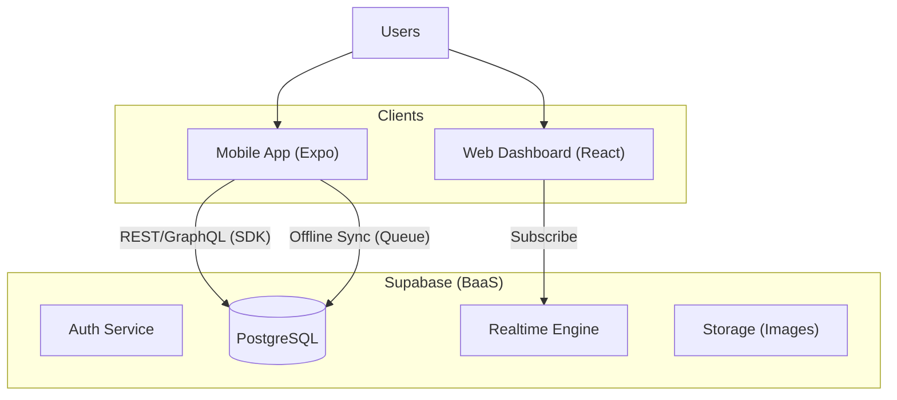

# LEAN WMS - Architecture & Tech Stack

## 1. High-Level Architecture (Serverless/BaaS)

## 2. Tech Stack Decisions

### A. Backend: Supabase

- **Why:** Instant PostgreSQL, Authentication, and Realtime subscriptions.
- **Role:** Handles data storage, user management, and row-level security (RLS).

### B. Mobile: Expo (React Native)

- **Why:** "Write once, run everywhere". Fastest iteration cycle.
- **Key Libs:** `expo-barcode-scanner` (Scanning), `sqlite` (Offline Store), `@tanstack/react-query` (State).

### C. Web Dashboard: TanStack Start

- **Why:** Standard, high-performance web stack, future intergrate tauri.
- **Key Libs:** `lucide-react` (Icons).

---

## 3. Database Schema (PostgreSQL)

### Core Tables

#### `users` (Managed by Supabase Auth)

- `id` (UUID)
- `role` (enum: 'admin', 'manager', 'worker')
- `full_name`

#### `products`

- `sku` (PK, String)
- `name`
- `barcode` (Unique)
- `min_stock_level`

#### `locations`

- `id` (PK)
- `name` (e.g., "A1-01")
- `type` (enum: 'staging', 'rack', 'bin')

#### `inventory`

- `id` (PK)
- `sku` (FK -> products.sku)
- `location_id` (FK -> locations.id)
- `quantity` (Int)
- `batch_no` (Optional, for FIFO)
- `expiry_date` (Optional, for FEFO)

#### `orders` (Inbound/Outbound)

- `id` (PK)
- `type` (enum: 'inbound', 'outbound')
- `status` (enum: 'draft', 'pending', 'processing', 'completed')
- `created_by` (FK -> users.id)

#### `inventory_transactions` (Audit Log)

- `id` (PK)
- `sku`
- `from_location`
- `to_location`
- `quantity`
- `performed_by` (FK -> users.id)
- `timestamp`

---

## 4. Offline Strategy (Action Queue)

1. **Offline Mode:** User actions (Scan, Move) are saved to a local `ActionQueue` table (SQLite).
2. **Optimistic UI:** Context updates immediately to show "success".
3. **Sync:** Background job detects connection -> Replays `ActionQueue` to Supabase.
4. **Conflict:** Last Write Wins (Phase 1).
